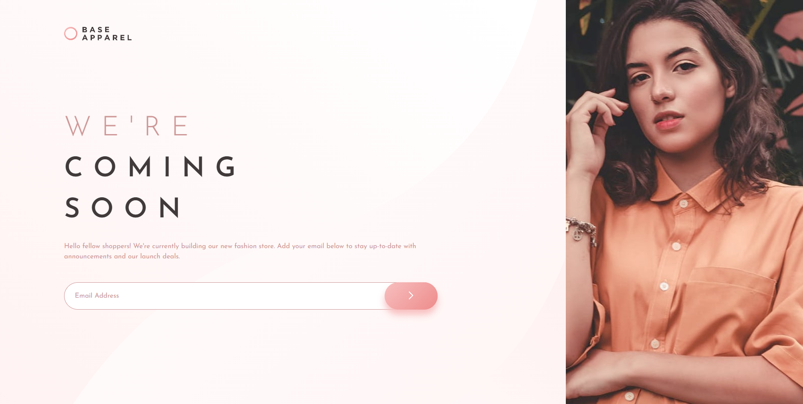

# Frontend Mentor - Base Apparel coming soon page solution

This is a solution to the [Base Apparel coming soon page challenge on Frontend Mentor](https://www.frontendmentor.io/challenges/base-apparel-coming-soon-page-5d46b47f8db8a7063f9331a0). Frontend Mentor challenges help you improve your coding skills by building realistic projects. 

## Table of contents

- [Overview](#overview)
  - [The challenge](#the-challenge)
  - [Screenshot](#screenshot)
  - [Links](#links)
- [My process](#my-process)
  - [Built with](#built-with)
  - [What I learned](#what-i-learned)
  - [Continued development](#continued-development)
  - [Useful resources](#useful-resources)
- [Author](#author)
- [Acknowledgments](#acknowledgments)

## Overview

### The challenge

Users should be able to:

- View the optimal layout for the site depending on their device's screen size
- See hover states for all interactive elements on the page

### Screenshot

### Links

- Solution URL: [https://www.frontendmentor.io/solutions/responsive-base-apparel-html-css-rtyjc-kkO3](https://www.frontendmentor.io/solutions/responsive-base-apparel-html-css-rtyjc-kkO3)
- Live Site URL: [https://justcaiodev.github.io/Base-Apparel/](https://justcaiodev.github.io/Base-Apparel/)

## My process

### Built with

- Semantic HTML5 markup
- CSS custom properties
- Flexbox

## Author

- GitHub - [@justCaioDev](https://github.com/justCaioDev)
- Frontend Mentor - [@JustCaioDev](https://www.frontendmentor.io/profile/justCaioDev)
- LinkedIn - [Caio Azevedo](https://www.linkedin.com/in/caiio/)
